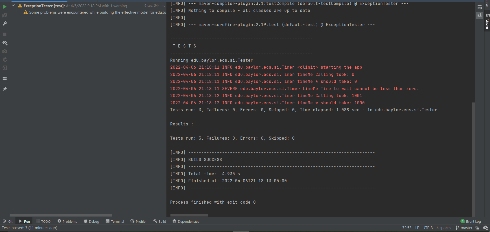

Answered README.md:

1. **See logger.log, why is it different from the log to console?** 

    logger.log is the output file from the Logger object responsible for printing info messages about
    this program's output. Loggers differ from logging to console as they can persist multiple runs,
    set specificity for the level of a message (info, warning, etc.), as well as provide more information
    then a normal console log. The logger will print INFO level or above to the console according to logger.properties.
<br></br>

2. **Where does this line come from?** 
   ```
   FINER org.junit.jupiter.engine.execution.ConditionEvaluator logResult Evaluation of condition [org.junit.jupiter.engine.extension.DisabledCondition] 
   resulted in: ConditionEvaluationResult [enabled = true, reason = '@Disabled is not present']
   ```

   This line is present only in the logger.log file as it is set as FINER level, and only messages of
   INFO level or above will be printed to the console. This originates from the methods with AssertTrue
   in them as jUnit has built in integration with the logger to print these messages should
   that method be executed.
<br></br>

3. **What does Assertions.assertThrows do?**

     This method will cause an AssertionFailedError should the passed lambda parameter
     not result in the specified assertion passed as the first parameter. The method
     should be called as assertThrows(expectedExceptionType.class(), lambda expression to throw assertion),
     and will only not cause an error if the expected assertion type is indeed thrown.
<br></br> 

4. **See TimerException and there are 3 questions**
    1. _What is serialVersionUID and why do we need it? (please read on Internet)_
   
    This is used to differentiate serializable classes, which java Exceptions are one of. This ID allows us
    to pack and unpack a serializable object. These changes based on the class version and many other attributes
    and basically allows the class to be distinguishable from others.
  
    2. _Why do we need to override constructors?_
    
    If we used the superclass constructors, then it would actually end up throwing the superclass
    exception rather than our class, which would break functionality. Therefore, we need
    to explicitly override these instead of just calling superclass constructors for intended functionality.

    3. _Why we did not override other Exception methods?_
   
    These methods are the only ones that we are using and the default functionality
    works just fine for our usages here, as we are only using it to be thrown and caught between 
    methods along with a name and some messages.
<br></br>

5. **The Timer.java has a static block static {}, what does it do? (determine when called by debugger)**

   This is called the first time the class is used within the program, which in this case is within
   the test timer edgecase jUnit test whenever the timeMe method is first called. This initializes
   the Timer's logger object by reading in the properties from the logger.properties file
   and formatting the logger accordingly. This sets the logger's output to the console to only
   be info messages and above and formats the date/time strings to be output.
<br></br>

6. **What is README.md file format how is it related to bitbucket?** _(https://confluence.atlassian.com/bitbucketserver/markdown-syntax-guide-776639995.html)_

   README.md is a file formatted using markdown, which is a format that supports light text formatting and some html embeds.
   This allows the user to make a "cover file" for their software which is displayed when opening the repository in
   github or bitbucket. This is useful for anything you want people to read upon opening your repo.
<br></br>

7. **Why is the test failing? what do we need to change in Timer? (fix that all tests pass and describe the issue)**

   The test is failing as the timeNow variable within the 'finally' block in the timeMe method is null
   after a failing try block, which results in an unexpected NullPointerException instead of a timerException.
   I have changed it so that the timer no longer has a 'finally' block, only throwing the exception and logging
   a warning message about invalid use of the timer.
<br></br>

8. **What is the actual issue here, what is the sequence of Exceptions and handlers (debug)**

   I'm not sure which specific issue this question is referring to. I see a few possible items.
   For one, this timer does not work properly in debug, and if debugging between certain methods
   can cause the timer to calculate incorrectly. The timer does not output exactly 1000 during
   the passing method due to a small amount of ms between the thread sleeping and waking up
   for the method to report the time. There could also be an issue with having multiple threads sleeping
   if tests were run in parallel, but as these tests are sequential, that issue does not seem to
   be happening here.
<br></br>

9. **Make a printScreen of your eclipse JUnit5 plugin run (JUnit window at the bottom panel)** 


<br/>

10. **Make a printScreen of your eclipse Maven test run, with console**

<br></br>

11. **What category of Exceptions is TimerException and what is NullPointerException**

      TimerException is a subclass of Exception and NullPointerException is a subclass of 
      RuntimeException. RuntimeExceptions are intended to be exceptions that can be prevented
      programmatically, whereas exception is the base class of all exceptions regardless of nature.
<br></br>